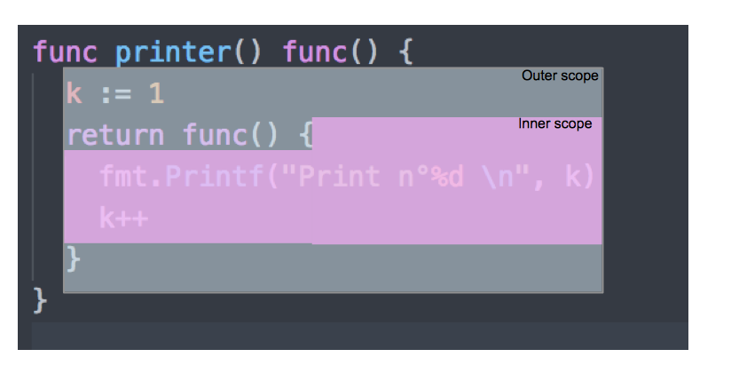

# 第 24 章: 匿名函数和闭包


## 1 你将在本章中学到什么? 

- 什么是匿名函数？
- 如何创建匿名函数。
- 如何调用匿名函数。
- 什么是闭包？
- 什么是函数类型？

## 2 提及的重要概念 

- 匿名函数
- 函数字面量
- 上下文
- 作用域

## 3 匿名函数 

匿名函数与普通函数类似，只是匿名函数没有被显式命名
要创建匿名函数，我么需要使用 func 关键字：
```go
// anonymous/anon/main.go
package main

import "fmt"

func main() {
    // 创建一个匿名函数
    func() {
        // 匿名函数体
        fmt.Println("I am anonymous function")
    }()
}
```

这里我们通过语法 `func(){..}` 定义了一个没有名字的函数，并且通过 `()` 执行该函数
因此，要定义一个匿名函数并立即执行，可以通过以下语法：
```go
func(){...}()
```
- 定义匿名函数： `func(){..}`
- 定义并立即执行： `func(){..}()`

让我们再举一个例子
```go
// anonymous/example-2/main.go
package main

import (
    "fmt"
    "reflect"
)

func main() {

    /**
     * 没有立即执行的匿名函数
     */
    myFunc := func() int {
        fmt.Println("I am a func litteral")
        return 42
    }
    // 输出 : 什么也没有输出～
    // 该匿名函数没有被执行

    fmt.Println(reflect.TypeOf(myFunc))
    // 输出 : func() int

    /**
     * 立即执行的匿名函数
     */
    funcValue := func() int {
        fmt.Println("I am a func literal invoked")
        return 42

    }()
    // 输出 : I am a func literal invoked
    // 该匿名函数被执行
    fmt.Println(reflect.TypeOf(funcValue))
    // 输出 : int

}
```
重点概括：
- 函数可以没有名称；
- 我们可以将函数本身存储到变量中（不同于以往变量中存储值，这点比较麻烦）。

## 4 函数类型
我们可以通过函数签名定义类型。这是从 gin 模块 (https://github.com/gin-gonic/gin) 中获取的示例：
```go
package gin

//...

type HandlerFunc func(*Context)

//...
```

这是从标准 http 包中获取的示例：
```go
package http
// ...
type HandlerFunc func(ResponseWriter, *Request)

//...
```

函数类型定义了函数的参数和返回值，当你定义一个函数变量，就可以创建一个该函数类型的变量。举个例子：
```go
type Funky func(string)

var f Funky
f = func(s string){
    // my function defined
    log.Printf("Funky %s",s)
}
f("Groovy")
```
- 我们定义了一个新的类型 `Funky` 。
`Funky` 类型表示参数为字符串且没有返回值的所有函数。`(func(string))`
- 我们创建一个 `Funky` 类型的变量 `f` 。
- 然后我们为变量 `f` 赋值一个匿名函数。
- 最后，我们执行 `f("Groovy")` 。

## 5 函数是 “一等公民”
在一些编程语言中，函数作为 “一等公民”， 允许他们：
- 作为参数
- 作为返回值
- 赋值给变量

Go语言中函数被认为是 “一等公民”， 这意味着：
- 函数可以作为参数传递给其他函数
- 函数可以作为返回值
- 函数可以赋值给变量 

## 6 闭包
定义到一个函数中的匿名函数，可以使用该函数作用域下的变量，即使该变量没有在匿名函数作用域下。
匿名函数可以保留对上下文的引用，当函数引用未在其作用域内的变量时，就会形成闭包。
### 6.1 示例
这是一个闭包的例子：
```go
// anonymous/first-closure/main.go
package main

import "fmt"

func printer() func() {
    k := 1
    return func() {
        fmt.Printf("Print n. %d\n", k)
        k++
    }
}

func main() {

    p := printer()
    p()
    // Print n. 1
    p()
    // Print n. 2
    p()
    // Print n. 3
}
```
我们有一个 `printer` 函数，该方法的签名是 `printer() func()`, 这个签名意味着这个函数将返回一个函数，
被返回的这个函数没有返回值。
我们可以使用签名 `func() int` 做为返回值，这意味着我们返回的函数将会返回一个整数。

让我们进入函数声明。首先，定义了一个初始化值为 1 的变量。然后返回一个匿名函数，该匿名函数
输出 `"Print n. %d\n"`, `%d` 的值为 `k` 。
- k为外部函数中定义的变量。
- 我们返回的新的匿名函数中，使用了外部变量k。

因此我们创建了一个闭包。
- 在 `main` 函数中，我们将 `printer` 函数的返回值（一个函数）赋值给 `p` 。
- `p` 是一个函数，我们只需在末尾添加括号即可执行这个被返回的函数：
```go
p() // 执行 p 这个闭包
```
`p` 的类型是 `func()` 。

### 6.2 作用域
- 我们说这个匿名函数获取了他的上下文的变量。
- 该函数保存了它当前运行环境的变量。

- 函数（或变量）的作用域是一个区域，我们可以在同一作用域内使用所有声明在该作用域内的变量（类型、常量）。
- 封闭函数定义了一个外部作用域。在我们的例子中，我们在 `printer` 函数的外部作用域定义变量 `k`, 然后在
返回的函数作用域（内部作用域）中使用 `k` 。
- 我们在内部作用域使用了一个外部作用域声明的变量。
- 闭包存储了我们在外部作用域声明的变量的引用。
- 所以我们在多次执行闭包时，变量 `k` 的值会增加。因为闭包持有引用，每次执行，都会修改底层的值。

## 7 闭包的一些常见用例

